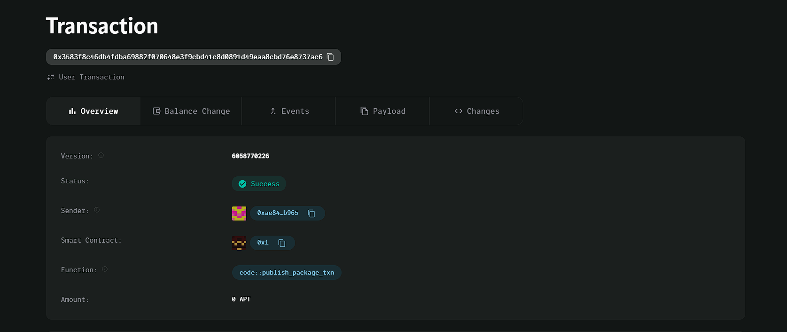

### Deployed smartcontract address: 0x3583f8c46db4fdba69882f070648e3f9cbd41c8d0891d49eaa8cbd76e8737ac6

### Screenshot:

# Micro-loan Platform

## Project Title
Micro-loan Platform

## Project Description
The Micro-loan Platform allows users to request and issue small loans via smart contracts. Borrowers can request loans, and lenders can issue loans using Aptos tokens (AptosCoin). The entire process is automated through the Move smart contract, ensuring transparency, security, and automatic repayments.

## Vision
To create a decentralized, transparent, and secure micro-loan platform that provides easy access to small loans for users, particularly those underserved by traditional financial institutions. The goal is to automate the loan issuance process and manage repayments through smart contracts, reducing friction and the need for intermediaries.

## Key Features
- **Loan Requests**: Borrowers can request loans by specifying the amount they need.
- **Loan Issuance**: Lenders can issue loans to borrowers by sending the requested amount directly through the smart contract.
- **Automatic Loan Management**: Smart contracts handle loan issuance and repayments, ensuring that funds are transferred securely between users.
- **Trustless Process**: All transactions are managed by the blockchain, ensuring no need for trust between borrowers and lenders.
  
## Future Scope
- **Repayment Tracking**: Implement automatic repayment functionality where borrowers can repay loans periodically.
- **Interest Calculation**: Add support for interest calculation to reward lenders for providing loans.
- **Loan Default Handling**: Introduce a mechanism to handle cases where borrowers fail to repay loans.
- **Credit Score**: Develop a decentralized credit score system based on borrower behavior and past loan history.
- **Loan Pools**: Create loan pools where multiple lenders can contribute to larger loans, reducing individual risk.
- **Cross-chain Integration**: Explore integration with other blockchain networks for seamless micro-loan services across platforms.
